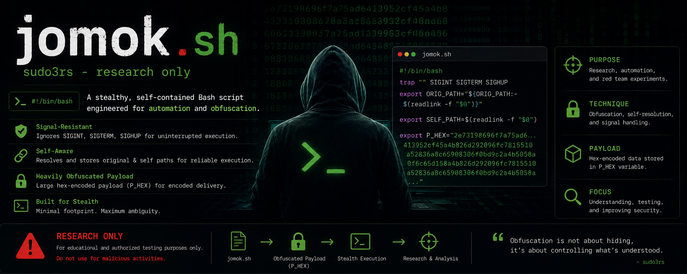
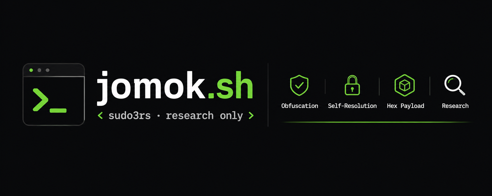
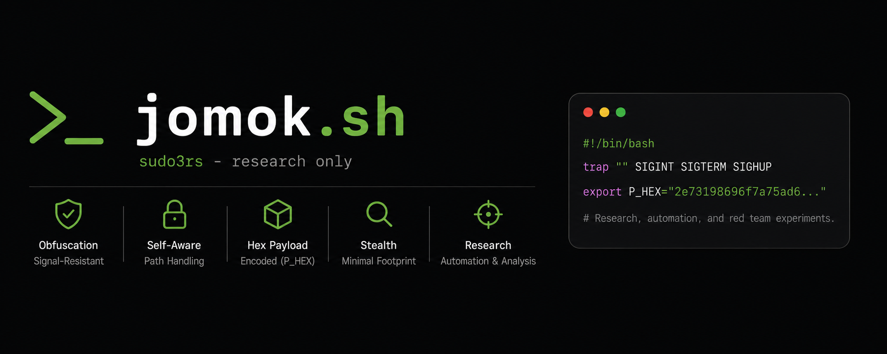

<div align="center">
  
  <h1>Jomok Payload V17.2 </h1>
  <p><b>Advanced, cross-platform, obfuscated payload toolkit for authorized research and educational purposes.</b></p>
</div>

## ⚠️ Disclaimer
**This project is for educational and authorized research purposes only.** Do not use these scripts on systems you do not own or have explicit permission to test. The author is not responsible for any misuse or damage caused by this toolkit.

> **🤖 AI Generation Note:** The sophisticated techniques and code structure within this toolkit were generated using **Claude AI Opus 4.8** to demonstrate the capabilities of advanced LLMs in generating complex, cross-platform security research tools.

---

## 📸 Previews

<div align="center">
  
  
</div>

---

## 🚀 Features

The primary payload (`jomok.sh` - V17.2 GOD MODE HARDENED) and its Windows counterparts (`jomok.ps1`, `jomok.bat`) demonstrate advanced execution and obfuscation techniques:

- **Anti-Debugging & Evasion:** Evades analysis tools (strace, gdb, wireshark, procmon) and debugging attempts.
- **In-Memory Decryption:** The core payload is encrypted using a 256-bit XOR cipher, decrypted in-memory using a Python subprocess (Plaintext never touches the disk).
- **Process Hiding & Silent Migration:** Execution leaves minimal traces, migrates to volatile storage (`/dev/shm`), and runs in detached sessions.
- **Resource Exhaustion:** CPU core saturation and RAM disk bombing to simulate denial of service.
- **Data Exfiltration:** Periodic background discovery and simulated exfiltration of sensitive files (SSH keys, env vars, databases).
- **SIEM Log Spilling:** Floods system logs and Event Viewer with fake critical alerts to distract analysts.
- **Cross-Platform Support:** Full feature parity across Linux (`jomok.sh`), Windows PowerShell (`jomok.ps1`), and Windows Batch (`jomok.bat`).

---

## 📚 Documentation

For an in-depth look into the mechanics, impact, and real-world scenarios, please refer to the detailed documentation:

- [Linux Bash Payload Mechanism](MECHANISM_SH.md)
- [Windows Batch Payload Mechanism](MECHANISM_BAT.md)
- [Windows PowerShell Payload Mechanism](MECHANISM_PS1.md)
- [Impact & Real-World Scenarios](IMPACT_AND_SCENARIOS.md)

---

## 📁 Repository Structure

The payloads have been categorized into two distinct directories for ease of research and analysis:
- **`Jomok Encrypted/`**: Contains the highly obfuscated, production-ready payloads (`jomok.sh`, `jomok.bat`, `jomok.ps1`) with in-memory XOR decryption and base64 encoded logic.
- **`Jomok Non Encrypt/`**: Contains the original, plaintext source code (`original_non_encrypt_jomok.sh`, etc.) for easier analysis and understanding without having to bypass the obfuscation layers.

---

## 🛠 Installation & Usage

Clone the repository:
```bash
git clone https://github.com/Masriyan/Jomok.git
cd Jomok
```

### Running `jomok.sh` (Linux/macOS)
```bash
cd "Jomok Encrypted"
chmod +x jomok.sh
./jomok.sh
```

### Running Windows Payloads
Navigate to the desired folder (e.g., `cd "Jomok Encrypted"`). For `jomok.bat` or `jomok.ps1`, run them directly from the Windows Command Prompt or PowerShell. Ensure you have the appropriate execution policies enabled for PowerShell.

## 🤝 Contributing
Contributions are welcome. Please open an issue or submit a pull request on the [GitHub repository](https://github.com/Masriyan/Jomok).

## 📄 License
For more details, please visit the main repository at [https://github.com/Masriyan/Jomok](https://github.com/Masriyan/Jomok).
